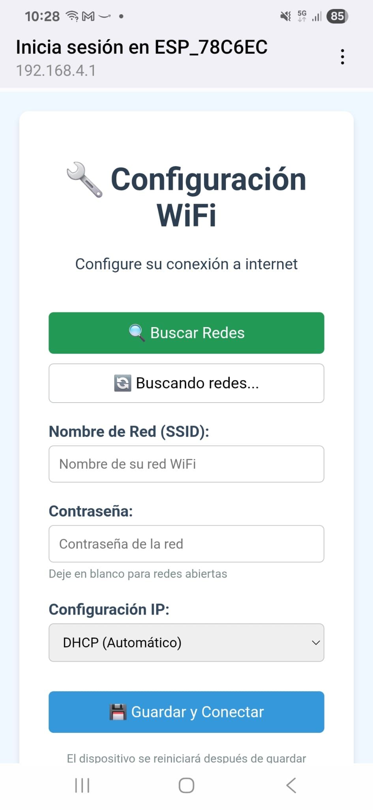
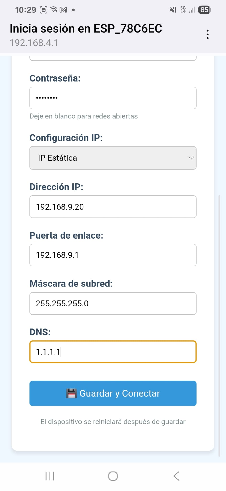
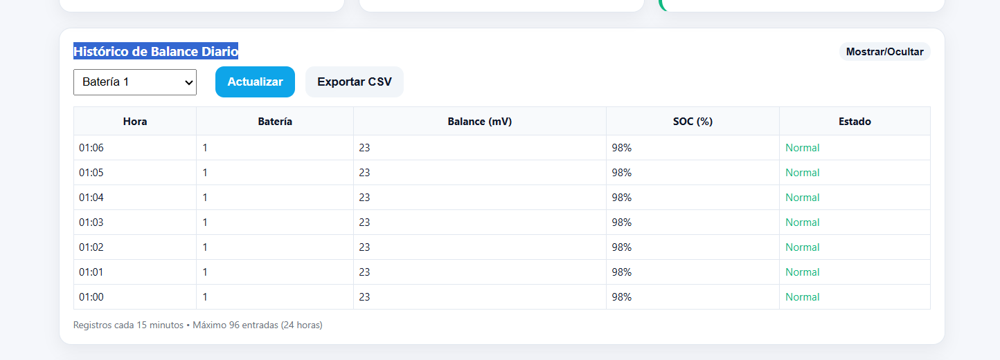

# Monitor Pylontech ESP32 - Versión Mejorada

**Basado en el proyecto original:** https://github.com/hidaba/PylontechMonitoring

Sistema completo de monitoreo para baterías Pylontech usando ESP32/ESP8266 con interfaz web avanzada y análisis de salud en tiempo real.


## Instalación y Configuración

### Librerías Requeridas:
**IMPORTANTE:** Antes de compilar, instalar estas librerías en Arduino IDE:

1. **NTPClient** by Fabrice Weinberg
   - Versión recomendada: 3.2.1 o superior
   - Para sincronización de tiempo vía NTP
   - Instalación: Tools > Manage Libraries > Buscar "NTPClient"

2. **LittleFS** (incluida con ESP8266/ESP32 Core)
   - Para almacenamiento persistente del historial

3. **ESP8266WiFi** o **WiFi** (incluidas con Core)
   - Para conectividad WiFi

### Requisitos:
- ESP32 o ESP8266
- MAX3232
- Arduino IDE o PlatformIO
- Conexión serial a sistema Pylontech
- Red WiFi

### Conexionado Físico

#### ESP32 Mini + MAX3232 + RJ45

**Conexiones ESP32 Mini → MAX3232:**
- Mini TX → T1IN del MAX3232
- Mini RX → R1OUT del MAX3232  
- Mini GND → GND del MAX3232
- Mini 3.3V → VCC del MAX3232

**NOTA: para programar la primera vez con arduino IDE, desconecta el positivo por ejemplo del modulo max3232 contra el ESP, si no no funcionará. Posteriormente programa via OTA. 
Se debe a la gestion de puertos, no es posible usar los UART de placa de arduino y el USB.
   

**Conexiones MAX3232 → RJ45 (Topología B):**
- R1IN del MAX3232 → Pin 3 (Blanco/Verde) - RX desde Pylontech
- T1OUT del MAX3232 → Pin 6 (Verde) - TX hacia Pylontech
- GND del MAX3232 → Pin 8 (Marrón) - Tierra común

#### Pinout RJ45 - Vista frontal
```
┌─────────────────────────────┐
│ 1 2 3 4 5 6 7 8            │
└─┴─┴─┴─┴─┴─┴─┴─┴───────────┘
      │     │   │
      │     │     └─ GND (Marrón)
      │     └─ TX (Verde)  
      └─ RX (Blanco/Verde)
```


## Configuración de Variables

Antes de compilar y usar el sistema, debe configurar las siguientes variables en el código:

### Variables Obligatorias

| Variable | Archivo | Descripción | Ejemplo |
|----------|---------|-------------|---------|
| `WIFI_SSID` | PylontechMonitoring.h | Nombre de la red WiFi | `"MiRedWiFi"` |
| `WIFI_PASS` | PylontechMonitoring.h | Contraseña de la red WiFi | `"MiContraseña123"` |
| `WIFI_HOSTNAME` | PylontechMonitoring.h | Nombre del dispositivo en la red | `"PylontechESP32"` |

### Variables de Configuración de Red

#### IP Estática (Opcional)
Para usar IP fija, descomente `#define STATIC_IP` en PylontechMonitoring.h y configure:

| Variable | Archivo | Descripción | Ejemplo |
|----------|---------|-------------|---------|
| `STATIC_IP` | PylontechMonitoring.h | Activar IP estática (descomente la línea) | `#define STATIC_IP` |
| `ip` | PylontechMonitoring.h | Dirección IP fija del ESP32 | `IPAddress ip(192, 168, 1, 100);` |
| `gateway` | PylontechMonitoring.h | Gateway de la red | `IPAddress gateway(192, 168, 1, 1);` |
| `subnet` | PylontechMonitoring.h | Máscara de subred | `IPAddress subnet(255, 255, 255, 0);` |
| `dns` | PylontechMonitoring.h | Servidor DNS | `IPAddress dns(192, 168, 1, 1);` |

**Para usar DHCP (IP automática):** Comente la línea `#define STATIC_IP` agregando `//` al inicio:
```cpp
// #define STATIC_IP
```

### Variables de Seguridad

#### Autenticación Web (Opcional)
Para proteger la interfaz web con usuario y contraseña:

| Variable | Archivo | Descripción | Ejemplo |
|----------|---------|-------------|---------|
| `AUTHENTICATION` | PylontechMonitoring.h | Activar autenticación (descomente) | `#define AUTHENTICATION` |
| `www_username` | PylontechMonitoring.h | Usuario para acceso web | `"admin"` |
| `www_password` | PylontechMonitoring.h | Contraseña para acceso web | `"mipassword123"` |

#### Contraseña OTA
| Variable | Archivo | Descripción | Ejemplo |
|----------|---------|-------------|---------|
| `ArduinoOTA.setPassword()` | PylontechMonitor_ESP32E_Display.ino (línea ~90) | Contraseña para actualizaciones remotas | `"ota123"` |

### Variables MQTT (Opcional)

| Variable | Archivo | Descripción | Ejemplo |
|----------|---------|-------------|---------|
| `DISABLE_MQTT` | PylontechMonitoring.h | Desactivar MQTT (descomente) | `#define DISABLE_MQTT` |
| `MQTT_SERVER` | PylontechMonitoring.h | Dirección IP del servidor MQTT | `"192.168.1.100"` |
| `MQTT_PORT` | PylontechMonitoring.h | Puerto del servidor MQTT | `1883` |
| `MQTT_USER` | PylontechMonitoring.h | Usuario MQTT | `"mqttuser"` |
| `MQTT_PASSWORD` | PylontechMonitoring.h | Contraseña MQTT | `"mqttpass"` |
| `MQTT_TOPIC_ROOT` | PylontechMonitoring.h | Raíz de topics MQTT | `"pylontech/sensor/"` |
| `MQTT_PUSH_FREQ_SEC` | PylontechMonitoring.h | Frecuencia envío datos (segundos) | `10` |


## Portal Cautivo WiFi - Configuración Automática

El sistema incluye un **portal cautivo WiFi** que facilita la configuración inicial y permite cambiar las credenciales sin necesidad de reprogramar el dispositivo.




### Funcionamiento Automático

#### Secuencia de Conexión Inteligente:
1. **Configuración Guardada** - Intenta conectar con credenciales almacenadas previamente
2. **Fallback Hardcoded** - Si falla, usa la configuración definida en el código (`WIFI_SSID`, `WIFI_PASS`)
3. **Portal de Configuración** - Si todo falla, abre un Access Point para configurar

### Acceso al Portal de Configuración

Cuando el dispositivo no puede conectarse a ninguna WiFi:

| Parámetro | Valor |
|-----------|-------|
| **SSID del AP** | `ESP_XXXXXX` (donde XXXXXX son los últimos 6 dígitos de la MAC) |
| **IP del Portal** | `192.168.4.1` |
| **Duración del AP** | 5 minutos (luego se reinicia) |

### Instrucciones de Uso

#### Primera Configuración:
1. **Encender el dispositivo** (primera vez o sin configuración guardada)
2. **Buscar WiFi "ESP_XXXXXX"** en tu teléfono/computadora (donde XXXXXX son los últimos 6 dígitos de la MAC del ESP)
3. **Conectar con contraseña "1234" si precisa** 
4. **Abrir cualquier página web** - serás redirigido automáticamente
5. **Configurar tu WiFi** en la interfaz web
6. **Guardar y esperar reinicio**

#### Cambiar Configuración WiFi:
- Mismo proceso que la primera configuración
- Se activa automáticamente si no puede conectar a la red configurada

### Interfaz de Configuración

La página de configuración incluye:

#### **Funcionalidades:**
- **Escáner de redes** - Busca y lista todas las WiFi disponibles
- **Indicador de señal** - Muestra la intensidad de cada red
- **Detección de seguridad** - Indica redes abiertas/protegidas
- **Selección fácil** - Click en cualquier red para autocompletar SSID
- **Configuración IP** - DHCP automático o IP estática personalizada
- **Almacenamiento persistente** - Las credenciales sobreviven reinicios

#### **Campos de Configuración:**
- **SSID** - Nombre de la red WiFi
- **Contraseña** - Clave de la red (opcional para redes abiertas)
- **Tipo IP** - DHCP (automático) o IP estática
- **IP Estática** - Dirección IP deseada (solo si se selecciona IP estática)
- **Gateway** - Puerta de enlace de la red
- **Máscara de subred** - Normalmente 255.255.255.0
- **DNS** - Servidor DNS (ej: 8.8.8.8)

### Gestión de Configuraciones

#### **Prioridad de Conexión:**
1. **Configuración del portal** (almacenada en LittleFS)
2. **Configuración hardcoded** (definida en `PylontechMonitoring.h`)
3. **Modo AP de configuración** (si ambas fallan)

#### **Recuperación Automática:**
- **Reconexión automática** si se pierde la conexión WiFi
- **Reintentos inteligentes** con diferentes configuraciones
- **Fallback a AP** si no se puede conectar tras varios intentos


## Ejemplos de Configuración

### Configuración Básica (Solo WiFi)
```cpp
// En PylontechMonitoring.h
#define WIFI_SSID "MiRedWiFi"
#define WIFI_PASS "MiContraseña123"
#define WIFI_HOSTNAME "PylontechESP32"

// Comentar para usar DHCP
// #define STATIC_IP

// Comentar para desactivar autenticación
// #define AUTHENTICATION

// Comentar para desactivar MQTT
// #define DISABLE_MQTT
```

### Configuración con IP Estática
```cpp
// En PylontechMonitoring.h
#define STATIC_IP
IPAddress ip(192, 168, 1, 100);        // IP deseada para el ESP32
IPAddress gateway(192, 168, 1, 1);     // IP del router
IPAddress subnet(255, 255, 255, 0);    // Máscara de red estándar
IPAddress dns(192, 168, 1, 1);         // DNS (normalmente el router)
```

### Configuración con Autenticación Web
```cpp
// En PylontechMonitoring.h
#define AUTHENTICATION
const char* www_username = "admin";
const char* www_password = "mipassword123";  // ¡Cambiar por una contraseña segura!
```

### Configuración MQTT Completa
```cpp
// En PylontechMonitoring.h
#define MQTT_SERVER        "192.168.1.50"      // IP del broker MQTT
#define MQTT_PORT          1883
#define MQTT_USER          "homeassistant"
#define MQTT_PASSWORD      "mqtt_password"
#define MQTT_TOPIC_ROOT    "energia/baterias/"
#define MQTT_PUSH_FREQ_SEC 30                  // Enviar cada 30 segundos
```

### Configuración de Contraseña OTA
```cpp
// En PylontechMonitor_ESP32E_Display.ino (línea ~90)
ArduinoOTA.setPassword("mi_ota_password_seguro");  // ¡Cambiar por contraseña segura!
```

### Análisis de Salud de Baterías
Sistema proactivo de monitoreo específico para baterías LiFePO4:

#### Estados de Balance de Celdas:
- **Normal:** ≤40mV de diferencia entre celdas
- **Advertencia:** 40-60mV de diferencia 
- **Crítico:** >60mV de diferencia

#### Información Detallada:
- Número total de celdas monitoreadas
- Voltaje máximo y mínimo entre celdas
- Diferencia exacta en milivolts
- Mensaje descriptivo del estado
- Tooltip informativo con detalles específicos de celda

### Diseño Responsive
- **Desktop:** Layout de 4 columnas con tarjetas grandes
- **Tablet:** Layout adaptativo de 2 columnas
- **Mobile:** Layout de 1 columna con elementos optimizados
- **Terminal Móvil:** Scroll horizontal con hints visuales

#### Capturas de Pantalla:
   


### Pasos de Instalación:
1. Clonar o descargar este proyecto
2. Abrir el archivo `.ino` en Arduino IDE
3. Configurar la placa ESP32/ESP8266 en Tools > Board
4. Instalar las librerías necesarias si no están presentes
5. Configurar las variables de la tabla anterior según su entorno
6. Conectar físicamente el ESP32 al sistema Pylontech vía UART
7. Compilar y subir el código
8. Conectar a la red WiFi configurada
9. Acceder a la IP asignada al ESP32 desde un navegador

## Comandos BMS Soportados

### Comando `bat`
- **Propósito:** Información detallada de todas las celdas
- **Uso:** Vista sistema y análisis de balance
- **Datos:** Voltajes individuales, temperaturas, corrientes

### Comando `pwrsys`
- **Propósito:** Estado general del sistema
- **Uso:** Vista consolidada
- **Datos:** SOC, voltaje total, corriente del pack

### Comando `pwr`
- **Propósito:** Estado específico por módulo
- **Uso:** Vista individual de baterías
- **Datos:** Estado operacional, temperaturas

## Uso de la Interfaz

### Botones de Navegación:
- **"Sistema":** Vista consolidada de todas las baterías
- **"Batería X":** Vista individual del módulo específico
- **Detección Automática:** Solo aparecen los módulos conectados

### Tarjetas de Información:
1. **Estado de Carga (SOC):** Porcentaje con barra visual
2. **Voltaje:** Voltaje total del pack/módulo
3. **Corriente:** Corriente actual (carga/descarga)
4. **Potencia:** Potencia instantánea calculada
5. **Temperatura:** Promedio del sistema o módulo
6. **Salud Celdas:** Estado de balance con tooltip informativo

### Terminal BMS:
- **Datos en Tiempo Real:** Actualización cada 3 segundos
- **Scroll Horizontal:** En móviles, deslizar para ver todos los datos
- **Colores Informativos:** Cada tipo de dato tiene su color
- **Formato Estructurado:** Headers y separadores visuales

### Tooltip de Información:
- **Activación:** Pasar el ratón sobre el icono "i" en Salud Celdas
- **Contenido:** Detalles específicos de voltajes por celda
- **Información:** Celda con mayor/menor voltaje y diferencias exactas

## Características Técnicas

### Comunicación Serial:
- **Protocolo:** ASCII comandos a 9600 baud
- **Timeout:** 5 segundos por comando
- **Buffer:** Optimizado para respuestas largas


## Histórico de Balance (72 Horas)

El sistema incluye un **sistema de registro histórico** que almacena automáticamente los datos de balance de las baterías para análisis de tendencias y monitoreo a largo plazo.


### Características del Histórico

#### **Sincronización de Tiempo:**
- **Sincronización NTP automática** con pool.ntp.org
- **Zona horaria configurada** para Madrid, España (UTC+2 CEST - horario de verano)
- **Resincronización cada hora** para mantener precisión
- **Timestamps Unix reales** en lugar de tiempo relativo
- **Endpoint `/time-info`** para verificar estado del tiempo

#### **Datos Registrados Automáticamente:**
- **ID de Batería** (1-16)
- **Diferencia de Balance** en mV (voltaje máximo - mínimo por batería)
- **Estado de Carga (SOC)** en porcentaje
- **Timestamp** con fecha y hora exacta (tiempo real NTP)


¡
#### **Alertas Visuales:**
- **Normal (≤40mV)** - Verde, funcionamiento óptimo
- **Advertencia (40-60mV)** - Amarillo, revisar pronto
- **Crítico (>60mV)** - Rojo, atención inmediata requerida


#### **Limpieza Manual de Datos:**
Para borrar completamente el histórico de balance almacenado:

- **URL de Limpieza:** `http://IP_DEL_ESP32/clear-history`
- **Función:** Elimina todos los datos históricos del sistema de archivos
**Nota:** Esta acción no se puede deshacer. Los datos eliminados no son recuperables.


## Versión

**v2.0 - Monitor Avanzado**
Compatible con sistemas Pylontech y baterías LiFePO4 usando protocolo de comunicación estándar.

---

**Proyecto basado en:** https://github.com/hidaba/PylontechMonitoring  
**Desarrollado para sistemas Pylontech con ESP32/ESP8266**