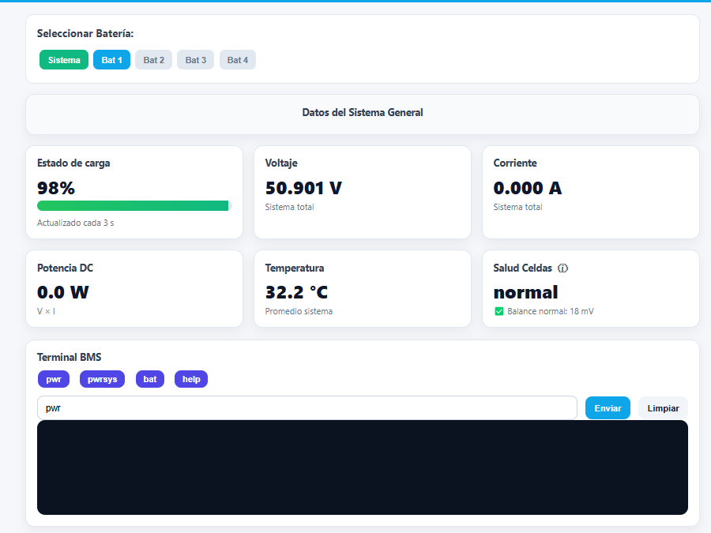
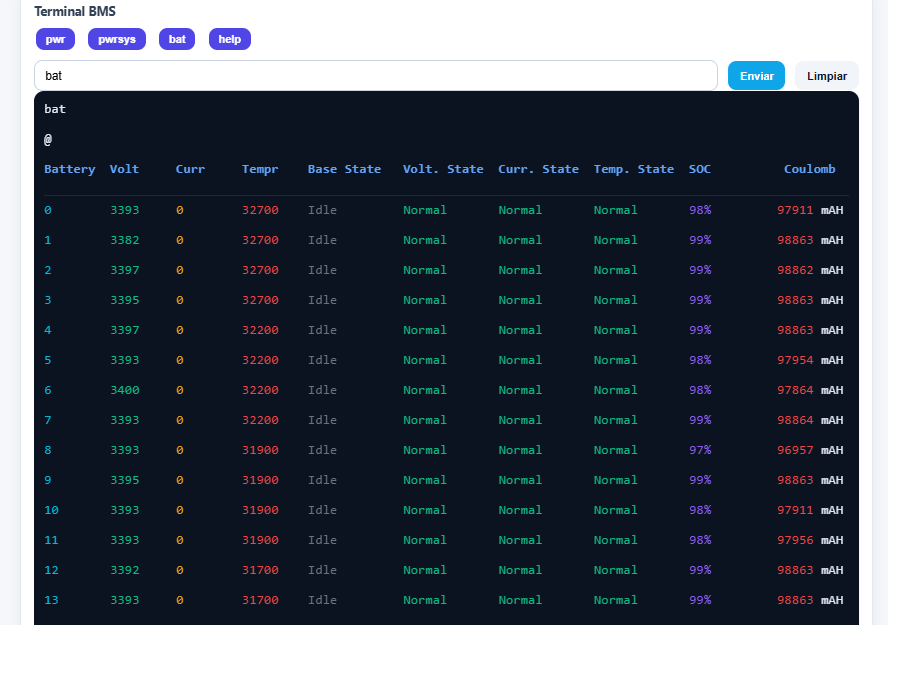
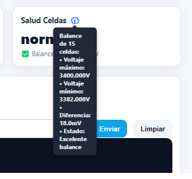

# Monitor Pylontech ESP32 - Versión Mejorada

**Basado en el proyecto original:** https://github.com/hidaba/PylontechMonitoring

Sistema completo de monitoreo para baterías Pylontech usando ESP32/ESP8266 con interfaz web avanzada y análisis de salud en tiempo real.


## Instalación y Configuración

### Requisitos:
- ESP32 o ESP8266
- MAX3232
- Arduino IDE o PlatformIO
- Conexión serial a sistema Pylontech
- Red WiFi

### Conexionado Físico

#### ESP32 Mini + MAX3232 + RJ45

**Conexiones ESP32 Mini → MAX3232:**
- Mini TX → T1IN del MAX3232
- Mini RX → R1OUT del MAX3232  
- Mini GND → GND del MAX3232
- Mini 3.3V → VCC del MAX3232

**Conexiones MAX3232 → RJ45 (Topología B):**
- R1IN del MAX3232 → Pin 3 (Blanco/Verde) - RX desde Pylontech
- T1OUT del MAX3232 → Pin 6 (Verde) - TX hacia Pylontech
- GND del MAX3232 → Pin 8 (Marrón) - Tierra común

#### Pinout RJ45 - Vista frontal
```
┌─────────────────────────────┐
│ 1 2 3 4 5 6 7 8            │
└─┴─┴─┴─┴─┴─┴─┴─┴───────────┘
      │     │   │
      │     │     └─ GND (Marrón)
      │     └─ TX (Verde)  
      └─ RX (Blanco/Verde)
```


## Configuración de Variables

Antes de compilar y usar el sistema, debe configurar las siguientes variables en el código:

### Variables Obligatorias

| Variable | Archivo | Descripción | Ejemplo |
|----------|---------|-------------|---------|
| `WIFI_SSID` | PylontechMonitoring.h | Nombre de la red WiFi | `"MiRedWiFi"` |
| `WIFI_PASS` | PylontechMonitoring.h | Contraseña de la red WiFi | `"MiContraseña123"` |
| `WIFI_HOSTNAME` | PylontechMonitoring.h | Nombre del dispositivo en la red | `"PylontechESP32"` |

### Variables de Configuración de Red

#### IP Estática (Opcional)
Para usar IP fija, descomente `#define STATIC_IP` en PylontechMonitoring.h y configure:

| Variable | Archivo | Descripción | Ejemplo |
|----------|---------|-------------|---------|
| `STATIC_IP` | PylontechMonitoring.h | Activar IP estática (descomente la línea) | `#define STATIC_IP` |
| `ip` | PylontechMonitoring.h | Dirección IP fija del ESP32 | `IPAddress ip(192, 168, 1, 100);` |
| `gateway` | PylontechMonitoring.h | Gateway de la red | `IPAddress gateway(192, 168, 1, 1);` |
| `subnet` | PylontechMonitoring.h | Máscara de subred | `IPAddress subnet(255, 255, 255, 0);` |
| `dns` | PylontechMonitoring.h | Servidor DNS | `IPAddress dns(192, 168, 1, 1);` |

**Para usar DHCP (IP automática):** Comente la línea `#define STATIC_IP` agregando `//` al inicio:
```cpp
// #define STATIC_IP
```

### Variables de Seguridad

#### Autenticación Web (Opcional)
Para proteger la interfaz web con usuario y contraseña:

| Variable | Archivo | Descripción | Ejemplo |
|----------|---------|-------------|---------|
| `AUTHENTICATION` | PylontechMonitoring.h | Activar autenticación (descomente) | `#define AUTHENTICATION` |
| `www_username` | PylontechMonitoring.h | Usuario para acceso web | `"admin"` |
| `www_password` | PylontechMonitoring.h | Contraseña para acceso web | `"mipassword123"` |

#### Contraseña OTA
| Variable | Archivo | Descripción | Ejemplo |
|----------|---------|-------------|---------|
| `ArduinoOTA.setPassword()` | PylontechMonitor_ESP32E_Display.ino (línea ~90) | Contraseña para actualizaciones remotas | `"ota123"` |

### Variables MQTT (Opcional)

| Variable | Archivo | Descripción | Ejemplo |
|----------|---------|-------------|---------|
| `DISABLE_MQTT` | PylontechMonitoring.h | Desactivar MQTT (descomente) | `#define DISABLE_MQTT` |
| `MQTT_SERVER` | PylontechMonitoring.h | Dirección IP del servidor MQTT | `"192.168.1.100"` |
| `MQTT_PORT` | PylontechMonitoring.h | Puerto del servidor MQTT | `1883` |
| `MQTT_USER` | PylontechMonitoring.h | Usuario MQTT | `"mqttuser"` |
| `MQTT_PASSWORD` | PylontechMonitoring.h | Contraseña MQTT | `"mqttpass"` |
| `MQTT_TOPIC_ROOT` | PylontechMonitoring.h | Raíz de topics MQTT | `"pylontech/sensor/"` |
| `MQTT_PUSH_FREQ_SEC` | PylontechMonitoring.h | Frecuencia envío datos (segundos) | `10` |


## 📡 Portal Cautivo WiFi - Configuración Automática

El sistema incluye un **portal cautivo WiFi** que facilita la configuración inicial y permite cambiar las credenciales sin necesidad de reprogramar el dispositivo.


### 🚀 Funcionamiento Automático

#### Secuencia de Conexión Inteligente:
1. **📱 Configuración Guardada** - Intenta conectar con credenciales almacenadas previamente
2. **🔄 Fallback Hardcoded** - Si falla, usa la configuración definida en el código (`WIFI_SSID`, `WIFI_PASS`)
3. **📡 Portal de Configuración** - Si todo falla, abre un Access Point para configurar

### 🔧 Acceso al Portal de Configuración

Cuando el dispositivo no puede conectarse a ninguna WiFi:

| Parámetro | Valor |
|-----------|-------|
| **SSID del AP** | `ESP_XXXXXX` (donde XXXXXX son los últimos 6 dígitos de la MAC) |
| **IP del Portal** | `192.168.4.1` |
| **Duración del AP** | 5 minutos (luego se reinicia) |

### 📱 Instrucciones de Uso

#### Primera Configuración:
1. 🔌 **Encender el dispositivo** (primera vez o sin configuración guardada)
2. 📶 **Buscar WiFi "ESP_XXXXXX"** en tu teléfono/computadora (donde XXXXXX son los últimos 6 dígitos de la MAC del ESP)
3. 🔐 **Conectar con contraseña "1234" si precisa** 
4. 🌐 **Abrir cualquier página web** - serás redirigido automáticamente
5. ⚙️ **Configurar tu WiFi** en la interfaz web
6. 💾 **Guardar y esperar reinicio**

#### Cambiar Configuración WiFi:
- Mismo proceso que la primera configuración
- Se activa automáticamente si no puede conectar a la red configurada

### 🌐 Interfaz de Configuración

La página de configuración incluye:

#### ✅ **Funcionalidades:**
- 🔍 **Escáner de redes** - Busca y lista todas las WiFi disponibles
- 📶 **Indicador de señal** - Muestra la intensidad de cada red
- 🔒 **Detección de seguridad** - Indica redes abiertas/protegidas
- 👆 **Selección fácil** - Click en cualquier red para autocompletar SSID
- ⚙️ **Configuración IP** - DHCP automático o IP estática personalizada
- 💾 **Almacenamiento persistente** - Las credenciales sobreviven reinicios

#### 📋 **Campos de Configuración:**
- **SSID** - Nombre de la red WiFi
- **Contraseña** - Clave de la red (opcional para redes abiertas)
- **Tipo IP** - DHCP (automático) o IP estática
- **IP Estática** - Dirección IP deseada (solo si se selecciona IP estática)
- **Gateway** - Puerta de enlace de la red
- **Máscara de subred** - Normalmente 255.255.255.0
- **DNS** - Servidor DNS (ej: 8.8.8.8)

### 🔄 Gestión de Configuraciones

#### **Prioridad de Conexión:**
1. 🥇 **Configuración del portal** (almacenada en LittleFS)
2. 🥈 **Configuración hardcoded** (definida en `PylontechMonitoring.h`)
3. 🥉 **Modo AP de configuración** (si ambas fallan)

#### **Recuperación Automática:**
- ⚡ **Reconexión automática** si se pierde la conexión WiFi
- 🔄 **Reintentos inteligentes** con diferentes configuraciones
- 📡 **Fallback a AP** si no se puede conectar tras varios intentos

### 💾 Almacenamiento de Configuración

Las credenciales se guardan en:
- **Sistema de archivos:** LittleFS
- **Archivo:** `/wifi_config.dat`
- **Persistencia:** Sobrevive reinicios, actualizaciones OTA
- **Seguridad:** Almacenado localmente en el ESP32

### 🛠️ Solución de Problemas

#### **Si el portal no aparece:**
- Verificar que no hay configuración WiFi válida
- Esperar 30 segundos tras encender
- Buscar red "ESP_XXXXXX" (donde XXXXXX son los últimos 6 dígitos de la MAC)

#### **Si no redirige automáticamente:**
- Navegar manualmente a `http://192.168.4.1`
- Verificar que está conectado al AP "ESP_XXXXXX"

#### **Para forzar modo configuración:**
- Borrar archivo `/wifi_config.dat` del sistema
- O mantener botón RESET 10 segundos tras encender

#### **Restablecer configuración:**
```cpp
// En setup(), agregar una vez:
LittleFS.remove("/wifi_config.dat");
```

### ⚠️ Notas Importantes

- 🔐 **Seguridad:** Cambiar la contraseña del AP en `wifiConfig.cpp` para mayor seguridad
- 📱 **Nombre del AP:** Cada dispositivo tendrá un nombre único "ESP_XXXXXX" basado en su MAC address
- ⏰ **Timeout:** El AP se cierra automáticamente tras 5 minutos sin configurar
- 🔄 **Reinicio:** El dispositivo se reinicia automáticamente tras guardar configuración
- 📱 **Compatibilidad:** Funciona con cualquier dispositivo WiFi (móvil, tablet, PC)

## Ejemplos de Configuración

### Configuración Básica (Solo WiFi)
```cpp
// En PylontechMonitoring.h
#define WIFI_SSID "MiRedWiFi"
#define WIFI_PASS "MiContraseña123"
#define WIFI_HOSTNAME "PylontechESP32"

// Comentar para usar DHCP
// #define STATIC_IP

// Comentar para desactivar autenticación
// #define AUTHENTICATION

// Comentar para desactivar MQTT
// #define DISABLE_MQTT
```

### Configuración con IP Estática
```cpp
// En PylontechMonitoring.h
#define STATIC_IP
IPAddress ip(192, 168, 1, 100);        // IP deseada para el ESP32
IPAddress gateway(192, 168, 1, 1);     // IP del router
IPAddress subnet(255, 255, 255, 0);    // Máscara de red estándar
IPAddress dns(192, 168, 1, 1);         // DNS (normalmente el router)
```

### Configuración con Autenticación Web
```cpp
// En PylontechMonitoring.h
#define AUTHENTICATION
const char* www_username = "admin";
const char* www_password = "mipassword123";  // ¡Cambiar por una contraseña segura!
```

### Configuración MQTT Completa
```cpp
// En PylontechMonitoring.h
#define MQTT_SERVER        "192.168.1.50"      // IP del broker MQTT
#define MQTT_PORT          1883
#define MQTT_USER          "homeassistant"
#define MQTT_PASSWORD      "mqtt_password"
#define MQTT_TOPIC_ROOT    "energia/baterias/"
#define MQTT_PUSH_FREQ_SEC 30                  // Enviar cada 30 segundos
```

### Configuración de Contraseña OTA
```cpp
// En PylontechMonitor_ESP32E_Display.ino (línea ~90)
ArduinoOTA.setPassword("mi_ota_password_seguro");  // ¡Cambiar por contraseña segura!
```

## Características Principales

### Dashboard Web Responsive
- **Dashboard Principal:** Vista general del sistema completo
- **Selector de Módulos:** Botones dinámicos para monitorear baterías individuales
- **Terminal BMS:** Output en tiempo real con colores y scroll horizontal
- **Diseño Mobile-First:** Optimizado para smartphones y tablets

### Monitoreo Multi-Batería
- **Detección Automática:** Identifica automáticamente qué módulos están conectados
- **Vista Sistema:** Datos consolidados de todas las baterías
- **Vista Individual:** Monitoreo específico por módulo
- **Cambio Dinámico:** Botones para alternar entre diferentes baterías

### Terminal BMS Avanzado
- **Colorización por Datos:**
  - Verde: Voltajes y estados normales
  - Naranja: Corrientes y potencia
  - Rojo: Temperaturas
  - Púrpura: Estado de carga (SOC)
  - Azul: Números y valores
  - Gris: Estados inactivos/ausentes

- **Scroll Horizontal:** Para dispositivos móviles con hint visual
- **Formato Tabular:** Datos organizados y fáciles de leer
- **Actualización Automática:** Cada 3 segundos

### Análisis de Salud de Baterías
Sistema proactivo de monitoreo específico para baterías LiFePO4:

#### Estados de Balance de Celdas:
- **Normal:** ≤40mV de diferencia entre celdas
- **Advertencia:** 40-60mV de diferencia 
- **Crítico:** >60mV de diferencia

#### Información Detallada:
- Número total de celdas monitoreadas
- Voltaje máximo y mínimo entre celdas
- Diferencia exacta en milivolts
- Mensaje descriptivo del estado
- Tooltip informativo con detalles específicos de celda

### Diseño Responsive
- **Desktop:** Layout de 4 columnas con tarjetas grandes
- **Tablet:** Layout adaptativo de 2 columnas
- **Mobile:** Layout de 1 columna con elementos optimizados
- **Terminal Móvil:** Scroll horizontal con hints visuales

#### Capturas de Pantalla:
   


### Pasos de Instalación:
1. Clonar o descargar este proyecto
2. Abrir el archivo `.ino` en Arduino IDE
3. Configurar la placa ESP32/ESP8266 en Tools > Board
4. Instalar las librerías necesarias si no están presentes
5. Configurar las variables de la tabla anterior según su entorno
6. Conectar físicamente el ESP32 al sistema Pylontech vía UART
7. Compilar y subir el código
8. Conectar a la red WiFi configurada
9. Acceder a la IP asignada al ESP32 desde un navegador

## Comandos BMS Soportados

### Comando `bat`
- **Propósito:** Información detallada de todas las celdas
- **Uso:** Vista sistema y análisis de balance
- **Datos:** Voltajes individuales, temperaturas, corrientes

### Comando `pwrsys`
- **Propósito:** Estado general del sistema
- **Uso:** Vista consolidada
- **Datos:** SOC, voltaje total, corriente del pack

### Comando `pwr`
- **Propósito:** Estado específico por módulo
- **Uso:** Vista individual de baterías
- **Datos:** Estado operacional, temperaturas

## Uso de la Interfaz

### Botones de Navegación:
- **"Sistema":** Vista consolidada de todas las baterías
- **"Batería X":** Vista individual del módulo específico
- **Detección Automática:** Solo aparecen los módulos conectados

### Tarjetas de Información:
1. **Estado de Carga (SOC):** Porcentaje con barra visual
2. **Voltaje:** Voltaje total del pack/módulo
3. **Corriente:** Corriente actual (carga/descarga)
4. **Potencia:** Potencia instantánea calculada
5. **Temperatura:** Promedio del sistema o módulo
6. **Salud Celdas:** Estado de balance con tooltip informativo

### Terminal BMS:
- **Datos en Tiempo Real:** Actualización cada 3 segundos
- **Scroll Horizontal:** En móviles, deslizar para ver todos los datos
- **Colores Informativos:** Cada tipo de dato tiene su color
- **Formato Estructurado:** Headers y separadores visuales

### Tooltip de Información:
- **Activación:** Pasar el ratón sobre el icono "i" en Salud Celdas
- **Contenido:** Detalles específicos de voltajes por celda
- **Información:** Celda con mayor/menor voltaje y diferencias exactas

## Características Técnicas

### Comunicación Serial:
- **Protocolo:** ASCII comandos a 9600 baud
- **Timeout:** 5 segundos por comando
- **Buffer:** Optimizado para respuestas largas

### Servidor Web:
- **Puerto:** 80 (HTTP)
- **Endpoints:**
  - `/` - Interfaz principal
  - `/battery-data` - Datos JSON del sistema
  - `/battery-data?module=X` - Datos JSON módulo específico
  - `/modules` - Lista de módulos detectados

### Gestión de Memoria:
- **String Buffers:** Optimizados para ESP32/ESP8266
- **Cache:** Sin cache para datos en tiempo real
- **CORS:** Configurado para desarrollo

## 📊 Histórico de Balance (72 Horas)

El sistema incluye un **sistema de registro histórico** que almacena automáticamente los datos de balance de las baterías para análisis de tendencias y monitoreo a largo plazo.

### 🎯 Características del Histórico

#### **Datos Registrados Automáticamente:**
- 🔋 **ID de Batería** (1-16)
- ⚡ **Diferencia de Balance** en mV (voltaje máximo - mínimo por batería)
- 🔋 **Estado de Carga (SOC)** en porcentaje
- ⏰ **Timestamp** con fecha y hora exacta

#### **Configuración de Almacenamiento:**
| Parámetro | Valor | Descripción |
|-----------|-------|-------------|
| **Frecuencia de Registro** | 15 minutos | Captura automática cada 15 min |
| **Capacidad Máxima** | 288 entradas | 72 horas completas de datos |
| **Tipo de Buffer** | Circular | Los datos antiguos se sobrescriben |
| **Persistencia** | LittleFS | Datos sobreviven reinicios |
| **Archivo de Datos** | `/balance_history.dat` | Almacenamiento binario optimizado |
| **Respaldo Automático** | Cada hora | 4 registros = 1 respaldo a flash |

### 🌐 Interfaz Web del Histórico

#### **Acceso a la Información:**
- **Ubicación:** Sección "Histórico de Balance (72h)" en la página principal
- **Visibilidad:** Botón "Mostrar/Ocultar" para expandir la sección
- **Actualización:** Botón "Actualizar" para recargar datos más recientes

#### **Funcionalidades de la Tabla:**
- ✅ **Tabla Scrolleable** - Ver hasta 288 entradas con scroll vertical
- ✅ **Filtro por Batería** - Dropdown para mostrar solo una batería específica
- ✅ **Código de Colores** - Estados visuales (Normal/Advertencia/Crítico)
- ✅ **Exportación CSV** - Descargar datos para análisis externo
- ✅ **Formato Responsive** - Adaptado para móviles y tablets

#### **Columnas de Información:**
| Columna | Descripción | Ejemplo |
|---------|-------------|---------|
| **Hora** | Timestamp del registro | `14:30` |
| **Batería** | ID del módulo | `1`, `2`, `3`... |
| **Balance (mV)** | Diferencia de voltaje entre celdas | `25`, `45`, `67` |
| **SOC (%)** | Estado de carga en ese momento | `85%`, `92%` |
| **Estado** | Evaluación automática | Normal/Advertencia/Crítico |

### 🔄 API REST del Histórico

#### **Endpoint de Datos:**
```
GET /balance-history
```

#### **Respuesta JSON:**
```json
{
  "data": [
    {
      "timestamp": 1695654000000,
      "batteryId": 1,
      "balanceMv": 25,
      "socPercent": 85
    },
    {
      "timestamp": 1695654900000,
      "batteryId": 2,
      "balanceMv": 45,
      "socPercent": 84
    }
  ],
  "totalEntries": 144,
  "maxEntries": 288,
  "currentTime": 1695654000000
}
```

### 📈 Análisis y Monitoreo

#### **Patrones Detectables:**
- 🔍 **Tendencias de Degradación** - Aumento progresivo del desbalance
- ⚠️ **Problemas Emergentes** - Celdas que comienzan a desbalancearse
- 📊 **Correlación SOC-Balance** - Relación entre carga y equilibrio
- 📈 **Ciclos Completos** - Monitoreo de múltiples ciclos de carga/descarga
- 🔄 **Patrones Diarios** - Comparación entre días consecutivos
- ⏰ **Horarios Críticos** - Identificación de momentos problemáticos

#### **Ventajas de 72 Horas:**
- **📅 3 Días Completos** - Análisis de tendencias a corto/medio plazo
- **🔄 Múltiples Ciclos** - Observar varios ciclos de carga completos
- **📊 Comparación Temporal** - Ver el mismo horario en diferentes días
- **⚡ Detección Temprana** - Identificar problemas antes que se agraven
- **📈 Memoria Eficiente** - Solo ~2.8KB de RAM para 288 entradas
- 🕒 **Comportamiento Temporal** - Patrones según hora del día

#### **Alertas Visuales:**
- 🟢 **Normal (≤40mV)** - Verde, funcionamiento óptimo
- 🟡 **Advertencia (40-60mV)** - Amarillo, revisar pronto
- 🔴 **Crítico (>60mV)** - Rojo, atención inmediata requerida

### 💾 Gestión de Datos

#### **Almacenamiento Local:**
- **Ubicación:** Flash interna del ESP32/ESP8266
- **Formato:** Binario optimizado para eficiencia
- **Compresión:** Estructura compacta para maximizar entradas
- **Integridad:** Verificación de validez en cada lectura

#### **Mantenimiento Automático:**
- **Limpieza:** Buffer circular automático
- **Optimización:** Respaldos cada hora para evitar pérdidas
- **Recuperación:** Carga automática al reiniciar

### 🛠️ Configuración Avanzada

#### **Modificar Intervalo de Registro:**
En `batteryStack.h`, línea ~42:
```cpp
const unsigned long RECORD_INTERVAL = 15 * 60 * 1000; // 15 minutos
```

#### **Cambiar Capacidad del Buffer:**
En `batteryStack.h`, línea ~9:
```cpp
#define MAX_BALANCE_HISTORY_ENTRIES 288 // 72 horas x 4 por hora
```

#### **Personalizar Respaldos:**
En el archivo principal, función `loop()`:
```cpp
if (saveCounter >= 4) { // Cada 4 registros = 1 hora
    // Cambiar a 2 para respaldar cada 30 min
    // Cambiar a 8 para respaldar cada 2 horas
}
```

### 📊 Casos de Uso

#### **Mantenimiento Preventivo:**
- Identificar baterías que comienzan a desbalancearse
- Programar balanceos antes de que se vuelvan críticos
- Detectar patrones de degradación temprana

#### **Análisis de Rendimiento:**
- Correlacionar desbalance con ciclos de carga/descarga
- Evaluar efectividad de balanceos realizados
- Optimizar rutinas de mantenimiento

#### **Documentación y Reportes:**
- Exportar datos históricos para análisis externo
- Generar reportes de salud del sistema
- Mantener registros para garantías y seguimiento


## Personalización

### Umbrales de Salud:
Modificar en `webInterface.h` líneas ~545-560:
```cpp
// Umbrales para baterías LiFePO4
if (imbalanceMv <= 40) {
  balanceStatus = "Normal";
} else if (imbalanceMv <= 60) {
  balanceStatus = "Advertencia"; 
} else {
  balanceStatus = "Crítico";
}
```

### Colores del Terminal:
Modificar en CSS líneas ~153-161:
```css
.terminal .voltage{color:#10b981}    /* Verde */
.terminal .current{color:#f59e0b}    /* Naranja */
.terminal .temperature{color:#ef4444} /* Rojo */
```

### Intervalos de Actualización:
Modificar en JavaScript:
```javascript
setInterval(pull, 3000); // 3 segundos
```

## Soporte y Troubleshooting

### Problemas Comunes:

1. **"Corriente 0.000 A":**
   - Solucionado: Parsing mejorado del comando `pwrsys`

2. **Terminal no responsive:**
   - Solucionado: Scroll horizontal automático en móviles

3. **Datos de temperatura inconsistentes:**
   - Solucionado: Promedio calculado desde comando `bat`

4. **No se detectan módulos:**
   - Verificar conexiones seriales
   - Comprobar que las baterías respondan al comando `pwr`

5. **No se conecta a WiFi:**
   - Verificar SSID y contraseña en la configuración
   - Comprobar que la red esté disponible
   - Revisar el monitor serie para mensajes de conexión

6. **Página web no carga:**
   - Verificar que el ESP32 esté conectado a WiFi
   - Comprobar la IP asignada en el monitor serie
   - Intentar acceso desde la misma red

### Debug:
- Usar monitor serie de Arduino IDE
- Verificar respuestas de comandos BMS
- Comprobar conectividad WiFi
- Revisar logs de conexión en monitor serie

## Mejoras Implementadas

- Interfaz multi-batería responsive
- Terminal colorizado y scrolleable
- Análisis de salud proactivo
- Optimización móvil completa
- Tooltip informativo con detalles de celdas
- Balance de celdas por módulo individual
- Detección automática de módulos
- Colores específicos por tipo de dato

## Versión

**v2.0 - Monitor Avanzado**
Compatible con sistemas Pylontech y baterías LiFePO4 usando protocolo de comunicación estándar.

---

**Proyecto basado en:** https://github.com/hidaba/PylontechMonitoring  
**Desarrollado para sistemas Pylontech con ESP32/ESP8266**